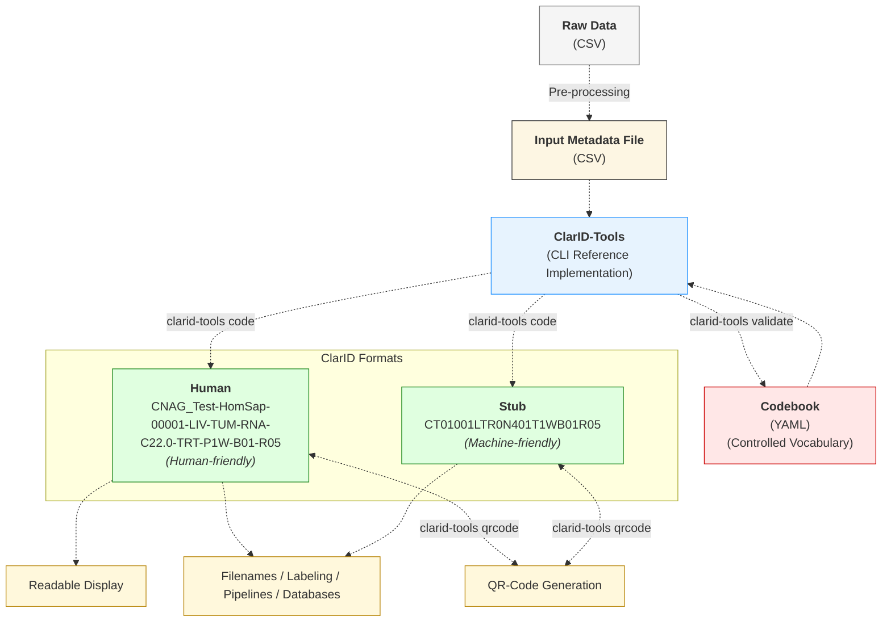

# Implementation Details

:::info[Reference implementation]
ClarID-Tools is the reference command-line implementation of the ClarID specification described in the accompanying paper.

:::
This page describes how the reference implementation turns structured metadata plus a validated codebook into human-readable and stub-format identifiers.

## Flowchart


## Workflow Summary

1. Prepare an input table containing normalized metadata fields.
2. Validate the codebook structure against the JSON Schema.
3. Encode metadata into `human` or `stub` identifiers with `clarid-tools code`.
4. Decode identifiers back to structured fields when needed.
5. Optionally generate QR codes from the resulting IDs.

In short, the paper defines the identifier model, while ClarID-Tools implements the operational workflow around that model.

## Architecture

This architecture describes the reference CLI implementation used to encode, decode, validate, and generate QR codes for ClarID identifiers.

- **Language and framework:** Perl 5, `Moo`, and `MooX::Options`. Perl was chosen
  for its efficiency in handling structured text files and its simplicity for a
  reference implementation.
- **Parsing / validation:** `YAML::XS`, `Text::CSV_XS`, `JSON::Validator` (codebook validated by JSON Schema).  
- **QR codes:** `qrencode` (Linux).  
- **Config:** YAML codebook (controlled vocabulary + optional aliases).

:::note[Reimplementation in other languages]
Implementations in other languages should follow the field order, encoding rules,
and codebook semantics defined in the specification.

If you are planning a reimplementation or language binding, please use the [repository issues page](https://github.com/CNAG-Biomedical-Informatics/clarid-tools/issues).

:::
---

## Design choices (short)

- Full externalization of the identifier spec into JSON Schema was tried but became complex (nested regexes and transforms).  
- **Hybrid approach:** core structural rules are implemented in code for clarity; domain vocabularies (species, tissues, assays, aliases) live in the YAML codebook and are schema-validated.  
- This keeps parsing deterministic and easier to maintain while retaining configurability.

## Normative vs operational details

- The identifier semantics are described in the ClarID paper and in the [Specification](specification.md).
- The CLI flags, file formats, and examples in this repository are operational details of the reference implementation.
- The YAML codebook is the main extension point for adapting ClarID-Tools to local vocabularies without changing the identifier model itself.

---

## Encoding / decoding

The `human` and `stub` formats are fully interoperable but serve different purposes: the human-readable form emphasizes interpretability, whereas the stub form emphasizes compactness for computational workflows.

### `project` / `study`
- Labels like `TCGA_AML` remain literal unless an **alias** is declared in the YAML codebook. Add aliases when you need short representations.

### `subject_id` — Base62, fixed width
- Numeric `subject_id` → Base62 (`0-9A-Za-z`) with **fixed width** (default: 3) to simplify parsing.
- Options:
  - `--subject_id_pad_length` — decimal padding width for `subject_id` in human format.
  - `--subject_id_base62_width` — width of the Base62 `subject_id` field in stub format.
- Example: `subject_id = 999` → Base62 `G7` → padded to `0G7`.
- Capacity: `62^width - 1` unique IDs.

:::note[Human-readable versus stub appearance]
Stub fields are compact encodings of the same metadata, not visual abbreviations of the human-readable identifier. In particular, `species` uses a static codebook `stub_code`, while `subject_id` is converted from the numeric subject identifier into Base62.

:::
### `condition` (disease)
- ICD-10 codes → internal numeric index → Base62 (fixed length, default 3).
- The numeric mapping is derived from the packaged ICD-10 order map distributed with ClarID-Tools (`icd10_order.json`).
- Human form: multiple conditions separated by `+`.  
- Stub form: condition codes concatenated (no separator); decoding uses reverse mapping.

:::warning[Condition ordering and versioning]
Stub `condition` values depend on the ICD-10 ordering distributed with the
reference implementation. Decode them with the same ClarID-Tools release and
mapping resources used for encoding. Keep the codebook and packaged mapping
files under version control.

:::
<details>
<summary>ICD-10 mapping resources</summary>

The current reference implementation uses packaged ICD-10 mapping resources. The details below document the source material and how the packaged mapping files were generated.

# ICD-10

Downloaded Jul-30-2025  
https://ftp.cdc.gov/pub/Health_Statistics/NCHS/Publications/ICD10CM/2026/icd10cm-table%20and%20index-2026.zip  
Version date: 6/12/2025

```bash
unzip *zip
# produces: icd10cm-tabular-2026.xml
```

The dot is stripped from the ICD-10 code when generating the JSON mapping.

```bash
jq -Rn '
  [ inputs
    | split("\t")
    | select(length == 2)
    | (.[1] as $code
       | ($code | gsub("\\."; ""))  as $key
       | { ($key): .[0] })
  ]
  | add
' icd10_label_code.tsv > icd10.json
```

```bash
jq '
  to_entries
| sort_by(.key)
| map(.key)
| to_entries
| map({ key: .value, value: (.key + 1) })
| from_entries
' icd10.json > icd10_order.json
```

</details>
### `species`
- `stub_code` declared in the YAML codebook as a codebook-defined species stub.  
- Species stub width is defined by the codebook and must be consistent within a given codebook.  
- One code (e.g., `00`) reserved for unknown.  
- Optional `tax_code` is kept for traceability (not used in stubs).

:::note[Species capacity]
The reference codebook uses a 2-character Base62 space, which supports up to 3,844 species codes. A 3-character Base62 space supports up to 238,328 species codes. If a project needs a larger species space, it can use longer `species.stub_code` values in the codebook, provided that the species stub width remains consistent within that codebook.

:::
:::note[Alternative species encodings]
ClarID-Tools does not impose a runtime encoding algorithm for `species`. The reference codebook uses a Base62-style convention, but other species-stub encodings are possible if they better fit a project's needs, provided that the chosen stub width remains consistent within the codebook.

:::
<details>
<summary>Illustrative Base62 generation for species stub codes</summary>

This example shows how a 2-character Base62 space can be generated for assigning `species.stub_code` values in the reference codebook.

ClarID-Tools does **not** perform this conversion at runtime. In the current implementation, `species` stub values are read directly from the YAML codebook.

```python
#!/usr/bin/env python3
ALPHABET = '0123456789ABCDEFGHIJKLMNOPQRSTUVWXYZabcdefghijklmnopqrstuvwxyz'
BASE = len(ALPHABET)
MAX_VALUE = BASE ** 2

def encode_base62(num: int) -> str:
    if not (0 <= num < MAX_VALUE):
        raise ValueError(f'Number out of range (0 <= num < {MAX_VALUE}), got {num}')
    high = num // BASE
    low = num % BASE
    return ALPHABET[high] + ALPHABET[low]
```

</details>
### `tissue`, `sample_type`, `assay`
- Use **predefined stub_codes** from the codebook (recommended 2–5 chars).  
- Decoding strategy: parse fixed-width fields first, then greedy reverse lookup on remaining stub codes sorted by descending length to avoid prefix collisions (e.g., `PB`, `T`, `HI` parse `PBTHI` correctly).

---

## Local adaptations

ClarID-Tools currently supports `subject` and `biosample`. Adding another entity
type, such as `cohort`, `dataset`, or `experiment`, requires code changes. When
code changes are not feasible, projects may repurpose an unused field while
retaining the existing identifier structure, for example by using `tissue` for
geographic location. Such use is project-specific, changes the field's documented
meaning, and should be recorded in the project codebook.

---

## Implementation notes & tips

- Keep stub codes short (2–5 chars) and unique to avoid parsing ambiguity. ✅  
- Increase `--subject_id_base62_width` before cohort size exceeds `62^width - 1`.  
- Use YAML codebook aliases for stable short labels.  
- Maintain the JSON Schema when editing the codebook.
- Re-run encode/decode examples after changing the codebook so documentation examples stay in sync with the current release.

---
